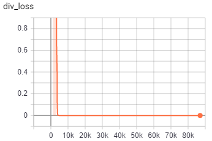
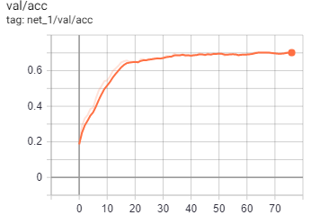
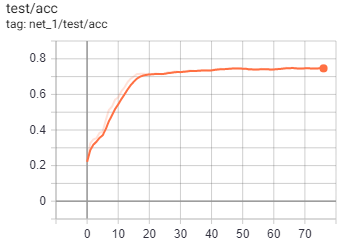

co-regularied-alignment-for-domain-adaptation
===========================
This is an UNOFFICIAL implemnetation of [Co-regularized Alignment for Unsupervised Domain
Adaptation](https://arxiv.org/pdf/1811.05443.pdf)

****

## Prerequisite
* python 3.6
* PyTorch 1.1
* tensorboard
* numpy
* cv2
* tqdm

***
## Training losses & results
|agreement loss|diverse loss|
|---|---
||
***

***

|net_num|validation|test|
|---|---|---
|net1||
|net2||
